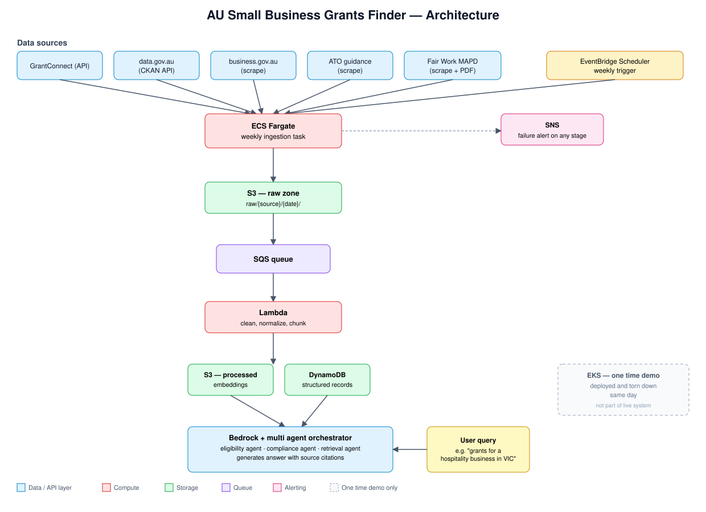

# AU Small Business Grants Finder

A multi agent Retrieval Augmented Generation (RAG) system that helps Australian small businesses discover relevant grants and understand compliance requirements. Built and deployed on AWS.

## Problem

Small business owners in Australia often miss out on grants they qualify for because the information is scattered across multiple government sources (GrantConnect, data.gov.au, business.gov.au, ATO guidance, Fair Work Commission MAPD) with inconsistent formats and no unified search.

## What this does

- Ingests grant and compliance data from Australian government sources on a scheduled basis
- Normalizes and stores the data for retrieval
- Uses a multi agent RAG pipeline to let a user ask natural language questions such as "What grants am I eligible for as a hospitality business in Victoria with 4 employees?"
- Returns relevant grants with eligibility criteria, deadlines, and source links

## Data sources

| Source | Type | Access method |
|---|---|---|
| GrantConnect (grants.gov.au) | Grants | Scraping (no public API; unlike the US grants.gov, GrantConnect does not publish one) |
| data.gov.au | Datasets | CKAN API |
| business.gov.au | Grants and programs | Scraping |
| ATO guidance | Tax compliance | Scraping |
| Fair Work Commission MAPD | Employment compliance | Scraping / PDF parsing |

## Architecture



Serverless first design to stay within a small AWS budget, with container based compute used only where it earns its place.

- **Ingestion**: AWS Lambda functions per source, triggered weekly by EventBridge Scheduler. The heavier scraping and parsing job runs on ECS Fargate, scheduled weekly.
- **Storage**: S3 for raw and processed data (raw zone and processed zone), DynamoDB for structured lookups
- **Queueing**: SQS to decouple ingestion from processing
- **Retrieval and generation**: Amazon Bedrock for embeddings and generation, multi agent orchestration for query routing (eligibility agent, compliance agent, retrieval agent)
- **Notifications**: SNS for pipeline failure alerts
- **One time demo**: EKS used for a single, same day teardown demonstration of container orchestration knowledge; not part of the live running system

See [docs/architecture.md](docs/architecture.md) for a detailed diagram and data flow.

## Budget

Designed to run on approximately $100 AUD, which shaped the decision to go serverless rather than running persistent compute (see cost notes in docs/architecture.md).

## Tech stack

- Python (ingestion, processing, RAG pipeline)
- AWS: Lambda, SQS, DynamoDB, S3, EventBridge Scheduler, SNS, Bedrock, ECS Fargate, EKS (demo only)
- Infrastructure as code: (Terraform or AWS CDK, see /infra)

## Project status

- **Implemented and tested**: GrantConnect scraper, data.gov.au CKAN client. Both have unit tests covering parsing, pagination, and error handling.
- **Stubbed, not yet implemented**: business.gov.au, ATO guidance, Fair Work Commission MAPD. Interfaces are defined; fetch logic is next.
- **Pipeline orchestrator**: working. Runs every source, isolates failures per source, writes raw output to S3 as newline delimited JSON.
- **Infrastructure**: S3 raw bucket created, scoped IAM user and policy defined (see infra/). Local credentials live in a gitignored `.env`.
- **Not yet started**: processing/normalization layer, RAG and multi agent query layer, ECS Fargate scheduling, DynamoDB, Bedrock integration, EKS demo.

See commit history for detailed progress.

## Getting started

```
git clone https://github.com/Zishan23/Australian-Small-Business-Grants-Finder.git
cd Australian-Small-Business-Grants-Finder
pip install -r requirements.txt
# create a local .env with AWS_ACCESS_KEY_ID and AWS_SECRET_ACCESS_KEY
```

Run the ingestion pipeline locally:

```
python -m src.ingestion.pipeline
```

Run the test suite:

```
pytest tests/ -v
```

## Author

Ismam Fatin Zishan ([ismamzishan.com](https://ismamzishan.com))
