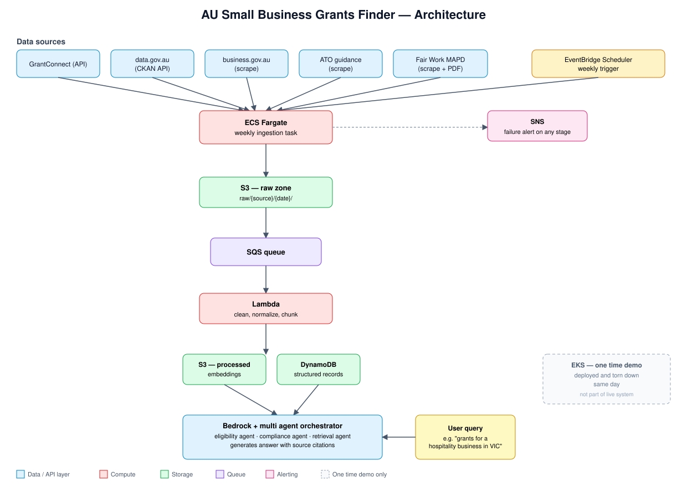

# AU Small Business Grants Finder

A multi agent Retrieval Augmented Generation (RAG) system that helps Australian small businesses discover relevant grants and understand compliance requirements. Built and deployed on AWS.

## Problem

Small business owners in Australia often miss out on grants they qualify for because the information is scattered across multiple government sources (GrantConnect, data.gov.au, business.gov.au, ATO guidance, Fair Work Commission MAPD) with inconsistent formats and no unified search.

## What this does

- Ingests grant and compliance data from Australian government sources on a scheduled basis
- Normalizes and stores the data for retrieval
- Uses a multi agent RAG pipeline to let a user ask natural language questions such as "What grants am I eligible for as a hospitality business in Victoria with 4 employees?"
- Returns relevant grants with eligibility criteria, deadlines, and source links

## Data sources

| Source | Type | Access method |
|---|---|---|
| GrantConnect (grants.gov.au) | Grants | Scraping (no public API; unlike the US grants.gov, GrantConnect does not publish one) |
| data.gov.au | Datasets | CKAN API |
| business.gov.au | Grants and programs | Scraping |
| ATO guidance | Tax compliance | Scraping |
| Fair Work Commission MAPD | Employment compliance | Scraping / PDF parsing |

## Architecture



Serverless first design to stay within a small AWS budget, with container based compute used only where it earns its place.

- **Ingestion**: AWS Lambda functions per source, triggered weekly by EventBridge Scheduler. The heavier scraping and parsing job runs on ECS Fargate, scheduled weekly.
- **Storage**: S3 for raw and processed data (raw zone and processed zone), DynamoDB for structured lookups
- **Queueing**: SQS to decouple ingestion from processing
- **Retrieval and generation**: Amazon Bedrock for embeddings and generation, multi agent orchestration for query routing (eligibility agent, compliance agent, retrieval agent)
- **Notifications**: SNS for pipeline failure alerts
- **One time demo**: EKS used for a single, same day teardown demonstration of container orchestration knowledge; not part of the live running system

See [docs/architecture.md](docs/architecture.md) for a detailed diagram and data flow.

## Budget

Designed to run on approximately $100 AUD, which shaped the decision to go serverless rather than running persistent compute (see cost notes in docs/architecture.md).

## Tech stack

- Python (ingestion, processing, RAG pipeline)
- AWS: Lambda, SQS, DynamoDB, S3, EventBridge Scheduler, SNS, Bedrock, ECS Fargate, EKS (demo only)
- Infrastructure as code: (Terraform or AWS CDK, see /infra)

## Project status

- **Ingestion — implemented and tested**: all five sources (GrantConnect, data.gov.au, business.gov.au, ATO guidance, Fair Work MAPD) have working fetch logic and unit tests against static HTML/text fixtures. The three scrapers added after the initial GrantConnect pass (business.gov.au, ATO, Fair Work MAPD) were written without access to the live sites from this environment — their selectors are a documented first pass; verify against real markup before relying on them, especially Fair Work MAPD's PDF pay-rate parsing.
- **Pipeline orchestrator**: working. Runs every source, isolates failures per source, writes raw output to S3 as newline delimited JSON.
- **Processing / normalization — implemented and tested**: `src/processing` maps each source's raw payload into a common `NormalizedRecord` schema (`src/processing/schema.py`), writes normalized output to the processed S3 zone, and batch-writes to DynamoDB (partition key `record_id`, on-demand billing recommended).
- **Multi agent RAG query layer — implemented and tested**: `src/rag` has a retrieval agent (keyword-overlap scoring today, with an injectable embedding function so real Bedrock embeddings drop in without changing callers), an eligibility agent and a compliance agent (each with a deterministic template fallback and an injectable Bedrock generation function), and an orchestrator that classifies each question and routes it. All AWS/Bedrock calls are isolated behind `src/rag/bedrock_client.py`, so none of this is exercised against real AWS yet — it's fully unit tested with mocked/injected clients.
- **Local demo website**: `src/website` is a FastAPI app + single-page chat UI that calls the RAG layer through `src/rag/interface.py`'s `QueryOrchestrator` contract. It currently runs against `MockQueryOrchestrator` (every answer is labeled as a demo in the UI); swapping in the real `RagQueryOrchestrator` with live records and a configured `BedrockClient` needs no changes to the website itself.
- **Infrastructure**: S3 raw bucket created, scoped IAM user and policy defined (see infra/). Local credentials live in a gitignored `.env`. Terraform/CDK for the processing DynamoDB table, SQS queue, ECS Fargate ingestion task, EventBridge schedule, SNS alerting, and Bedrock access is not yet written.
- **Not yet started / not yet deployed**: no AWS deployment of the processing or RAG layers, no real Bedrock calls, ECS Fargate scheduling, SNS alerting, EKS demo, and the three newer scrapers' selectors are unverified against live sites.

See commit history for detailed progress.

## Getting started

```
git clone https://github.com/Zishan23/Australian-Small-Business-Grants-Finder.git
cd Australian-Small-Business-Grants-Finder
pip install -r requirements.txt
# create a local .env with AWS_ACCESS_KEY_ID and AWS_SECRET_ACCESS_KEY
```

Run the ingestion pipeline locally:

```
python -m src.ingestion.pipeline
```

Run the test suite:

```
pytest tests/ -v
```

Run the local demo website:

```
uvicorn src.website.app:app --reload
```

Then open http://127.0.0.1:8000 and ask a question. Answers come from a mock backend today (clearly labeled in the UI) until the real RAG pipeline is deployed against live data.

## Author

Ismam Fatin Zishan ([ismamzishan.com](https://ismamzishan.com))
